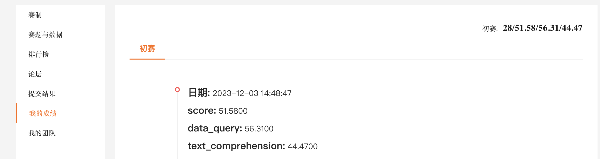
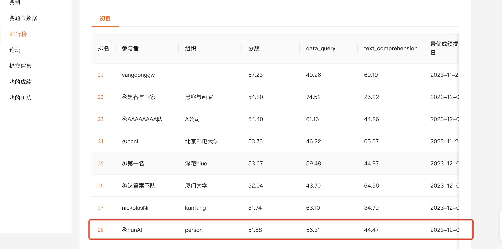

# 主页 
## ccf- https://ccf.pkucxpl.com/competitions/5 
## 天池 - https://tianchi.aliyun.com/competition/entrance/532164/information

# Overview
    1. 基于“通义千问金融大模型”构建一个问答系统，问答内容涉及基金/股票/债券/招股书等不同数据来源
	2. 要求参赛选手必须使用官方指定的大语言模型，可以采用公开访问的外部数据进行微调模型，也可以采用LangChain、向量数据库等相关技术。
    3. 包含两类任务，数据查询任务和文本理解任务，分别考察选手基于大语言模型的结构化数据检索能力和长文本理解能力,赛事主办方并不会提供任务的具体类型，选手需要自行判断任务的类别，采用不同的技术方案，或者同时构建查询任务并汇总结果

# 方案
## 初赛
    初赛考虑到先出结果，快速迭代，所以采用比较简单的方案
    1. 根据公司名称确定问题类型
    2. 文本理解：则根据公司名称加载对应招股书，然后根据招股书内容进行文本理解
    3. 数据查询：则根据问题和数据库schema 产生sql，然后进行数据查询获取结果
## 复赛
    想考虑使用agent自动处理所有问题，招股书/db都做为知识库，然后agent根据问题类型，自动选择合适的知识库进行处理，然后返回结果；
    可惜没有机会去实现。
## 决赛选手总结
    抽空看了下决赛选手的方案，感觉还是有很多可以借鉴和学习的地方，：
    1. 用户输入的问题，使用llm进行ner/分类以及改写等
    2. 数据库查询：常规的优化如对sql进行归类/模版化，然后微调，还有利用agent和思维链方式进行优化的，比如先选择表，然后再sql，或者拆分成几个子问题，然后再合并结果等等
    3. 文字理解：核心还是RAG + llm + 微调，细节上有很多优化
       1. 一般都重新对pdf进行了清洗；
       2. RAG：主流精准搜索（关键字或者类似es搜索引擎）+ 向量搜索，
    4. 微调的话，很多选手还是利用了gpt4来产生微调用的数据，然后再进行微调；
   
# 结果
    虽然很遗憾差一丢丢（前20）没有进入到最终复赛，不过第一次参加这种比赛就得到28名，也算不错了：）
    

    
# 总结
## 竞赛内容的一些总结
    1. 数据：
       1. 官方从pdf清理的txt数据内容质量一般，最后自己重新清理一把，效果上就很容易提高好几个点
       2. 试验了langchain支持的几个，感觉PyPDFLoader处理效果最好（主要观察table处理），但是个别pdf处理直接出错，另外繁体字处理是乱码，所以备选使用PyMuPDFLoader处理这些异常pdf
    2. 资源：
       1. 开发主要是kaggle的2*T4卡（29G左右）
       2. 跑任务主要用aliyun的24G A10卡，免费试用可以使用3个月
    3. 模型
       1. tongyi-finance-14B-Chat：推理能在kaggle跑起来，但只能是简单问题，复杂问题token一多就oom了，所以最后只能使用Int4量化模型推理
          1. Gpu 大概占用26-27g
          2. 没提供sharding版本，所以启动内存29g很容易oom
          3. 需要启用offload cpu/disk
       2. Qwen-7B-Chat：gpu 大概16g，能跑，但是如果token太长还是会oom，所以需要限定token最大长度；few shot prompt场景下token比较长，所以也用的不多
          1. temperature不能太低, 否则报“RuntimeError: probability tensor contains either `inf`, `nan` or element < 0.”
       3. Tongyi-finance-14B-4bit：gpu大概15g，基本上都是用这个模型跑，不过问题还是比较多
          1. 不能使用2个卡，否则报“RuntimeError: Expected all tensors to be on the same device, but found at least two devices, cuda:1 and cuda:0!”异常
          2. 类似Qwen-7B-Chat，temperature不能太低
          3. 幻觉感觉比较严重，要求它找不到报无有时莫名其妙给个答案；
          4. 虽然要求固定格式返回，但是返回的格式不大固定
       4. 中文embedding模型：使用M3E，感觉效果一般般，不过没找到更好，将就着用吧
    4. 任务：
       1. 任务划分：
          1. 基本上初赛问题不是文本就是数据查询，根据公司名称基本上能确定问题类型；
          2. 少量问题是公司名称使用简称，导致问题类型判断错误，但是数量不多，初期就直接人工处理了；
          3. 终极方案感觉应该agent利用llm来判断问题类型，然后再进行相应的处理；
       2. 文本理解任务：
          1. 根据公司找到招股书，然后将招股书拆分成chunk 计算和question的距离，然后根据距离排序，取最近的chunk 再发给llm进行处理；效果一般般，还没找到更好的方法及原因
          2. chunk size不同效果也不同，有些问题chunk size大一些效果好，有些问题chunk size小一些效果好，最后使用chunk size 1500 + 250混合使用
          3. quesition里面有公司关键词貌似效果还差一些，所以匹配的时候去掉了question里面的公司信息
       3. 数据查询任务：
          1. zero-shot，效果一般般，简单的能查出来，复杂的就查不出来了
          2. few-shot效果好一些，但是需要根据问题类型，选择合适的example，否则token太多oom
    5.  环境
        1.  aliyun无法使用外国如hf 服务，模型下载也是个小问题

## 不足
    1. 竞赛的经验不足，前期花了太多时间浪费在资源的获取和使用上，还有很多想法/算法没有时间去验证和实现，否则结果可能会更好一些
    2. 大模型的应用积累还不够，虽然各个模块也算比较熟悉，但是想达到sota性能，无论是经验和方法上还有些欠缺，需要继续积累沉淀
    3. 对中文的处理经验还不够，没有深入的研究和优化，导致效果上有些折扣
    4. Prompt Engineering还差一些，没有很好的利用prompt来优化模型，导致效果上不去

## 优点
    1. 使用open ai api作为底层框架来使用模型，现在很多模型/框架都兼容open ai api，可以很方便的切换模型和算法；
    2. 能魔改一些开源代码，兼容使用Tongyi模型

## 收获
    1. 对大模型的应用有了更深的理解和感悟，虽然大模型应用架构可能就这样，但是具体落地时候，对应的算法和应用细节有很多地方需要深度挖掘，才有可能做出真正的产品
    2. gpu资源不足导致对模型的使用和优化上有了更多的经验，比如使用量化模型/flash-attentions等等
    3. 对竞赛也有了更深的理解，不仅仅是算法，还有很多其他的东西，比如资源，比如时间等等
    4. 对一些开源的框架代码有了更深入的了解，比如langchain/tansformers/accelerate/flash-attention等等

## 遗憾
    1. gpu资源不足，只能使用量化模型推理，效率和效果上有些折扣； 不过还感谢kaggle/aliyun的免费gpu资源，不然可能连量化模型都跑不了，更别提有啥结果了

## todo
    1. 优化embeding，更好匹配问题，特别是中文上的处理
    2. finetune：将招股书整体finetune试试；另外nl2sql也可以好好根据schema调优一下
    3. agent的使用：缺少一个能从问题直接入手，然后不断优化的agent；备选：Modelscope agent/autogen
    4. 再试试14b跑2*T4卡能否执行推理（flash2等验证看看），可以慢，但是不能oom。
       1. 备选试试vllm
    5. 沉淀经验/技术/模型/Prompt Engineering

## 比赛前几名方案
    1. https://github.com/Tongyi-EconML/FinQwen
